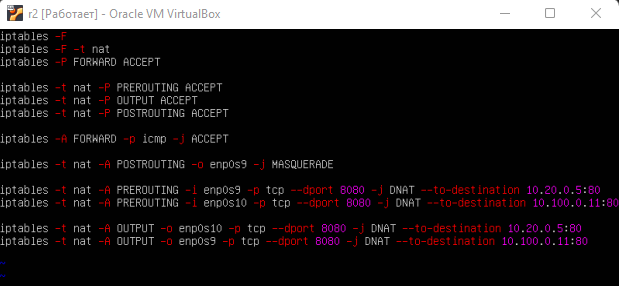

## Part 1. **ipcalc** tool

#### 1.1 Networks and Masks

##### 1). Network address of 192.167.38.54/13

 
<i>ipcalc output</i>

##### 2) Conversion of the mask 255.255.255.0 to prefix and binary, /15 to normal and binary, 11111111.11111111.11111111.11110000 to normal and prefix

 
<i>mask 255.255.255.0 conversion</i>

 
<i>mask /15 conversion</i>

 
<i>mask 11111111.11111111.11111111.11110000  conversion</i>

##### 3) Minimum and maximum host in 12.167.38.4 network with masks: /8, 11111111.11111111.00000000.00000000, 255.255.254.0 and /4

 
<i>Minimum and maximum host in 12.167.38.4 network with mask: /8</i>

 
<i>Minimum and maximum host in 12.167.38.4 network with mask: /11111111.11111111.00000000.00000000</i>

 
<i>Minimum and maximum host in 255.255.254.0 network with mask: /4</i>

#### 1.2. localhost

- can be accessed with 
	- 127.0.0.2
	- 127.1.0.1
- can’t with 
	- 194.34.23.100
	- 128.0.0.1

#### 1.3. Network ranges and segments

##### 1) which of the listed IPs can be used as public and which only as private: 10.0.0.45, 134.43.0.2, 192.168.4.2, 172.20.250.4, 172.0.2.1, 192.172.0.1, 172.68.0.2, 172.16.255.255, 10.10.10.10, 192.169.168.1

- private
	- 10.0.0.45
	- 192.168.4.2
	- 172.20.250.4
	- 172.16.255.255
	- 10.10.10.10
- public
	- 134.43.0.2
	- 172.0.2.1
	- 192.172.0.1
	- 172.68.0.2
	- 192.169.168.1

##### 2) which of the listed gateway IP addresses are possible for 10.10.0.0/18 network: 10.0.0.1, 10.10.0.2, 10.10.10.10, 10.10.100.1, 10.10.1.255

- possible
	- 10.10.0.2
	- 10.10.10.10
	- 10.10.1.255
- impossible
	- 10.0.0.1
	- 10.10.100.1

## Part 2. Static routing between two machines

 
<i>ws1 interfaces</i>

 
<i>ws2 interfaces</i>

 
<i>ws1 etc/netplan/00-installer-config.yaml</i>

 
<i>ws2 etc/netplan/00-installer-config.yaml</i>

#### 2.1. Adding a static route manually

 
<i>ip r and ping to ws2</i>

 
<i>ip r and ping to ws1</i>

#### 2.2. Adding a static route with saving

 
<i>ws1 etc/netplan/00-installer-config.yaml</i>

 
<i>ws2 etc/netplan/00-installer-config.yaml</i>

 
<i>ping to ws2</i>

 
<i>ping to ws2</i>

## Part 3. **iperf3** utility

#### 3.1. Connection speed

`8Mbps` &rarr; `1MB/s`

`100MB/s` &rarr; `819200Kbps`

`1Gbps` &rarr; `1024Mbps`

#### 3.2. **iperf3** utility

 
<i>iperf3 server side</i>

 
<i>iperf3 client side</i>

## Part 4. Network firewall

#### 4.1. **iptables** utility

 
<i>ws1 /etc/firewall file</i>

 
<i>ws2 /etc/firewall file</i>

 
<i>ws1 ping ws2</i>

 
<i>ws2 ping ws1</i>

In the first strategy, we allow everything that is not prohibited, and in the second we prohibit everything that is not allowed. But when writing rules, it is worth considering that the forbidding rules do not overwritten with the permissive ones

#### 4.2. **nmap** utility

 
<i>nmap command output</i>

## Part 5. Static network routing

#### 5.1. Configuration of machine addresses

 
<i>ws11 etc/netplan/00-installer-config.yaml</i>

 
<i>ws21 etc/netplan/00-installer-config.yaml</i>

 
<i>ws22 etc/netplan/00-installer-config.yaml</i>

 
<i>r1 etc/netplan/00-installer-config.yaml</i>

 
<i>r2 etc/netplan/00-installer-config.yaml</i>

 
<i>ws11 ip -4 a output and ping r1</i>

 
<i>ws21 ip -4 a output and ping ws22</i>

 
<i>ws22 ip -4 a output</i>

 
<i>r1 ip -4 a output</i>

 
<i>r2 ip -4 a output</i>

#### 5.2. Enabling IP forwarding.

 
<i>sysctl -w net.ipv4.ip_forward=1 command output for r1</i>

 
<i>sysctl -w net.ipv4.ip_forward=1 command output for r2</i>

 
<i>r1 /etc/sysctl.conf file</i>

 
<i>r2 /etc/sysctl.conf file</i>

#### 5.3. Default route configuration

 
<i>gateway for ws11</i>

 
<i>gateway for ws21</i>

 
<i>gateway for ws22</i>

 
<i>ws11 ping r2</i>

 
<i>r2 tcpdump command output</i>

 
<i>ws11 ip r command output</i>

 
<i>ws21 ip r command output</i>

 
<i>ws22 ip r command output</i>

#### 5.4. Adding static routes

 
<i>r1 etc/netplan/00-installer-config.yaml</i>

 
<i>r2 etc/netplan/00-installer-config.yaml</i>

 
<i>ip r command output for r1</i>

 
<i>ip r command output for r2</i>

 
<i>ip r list 10.10.0.0/18 and ip r list 0.0.0.0/0 commands output</i>

since the router always chooses a path with a larger mask, the default path will never be selected if there is another path

#### 5.5. Making a router list

 
<i>traceroute 10.20.0.10 command output</i>

 
<i>tcpdump -tnv -i enp0s8 command output</i>

traceroute sends packets, increasing the TTL until it reaches the target

#### 5.6. Using **ICMP** protocol in routing

 
<i>ping -c 1 10.30.0.111 command output</i>

 
<i>traceroute -n -i enp0s8 command output</i>

## Part 6. Dynamic IP configuration using **DHCP**

##### 1) specify the default router address, DNS-server and internal network address. Here is an example of a file for r2:

 
<i>/etc/dhcp/dhcpd.conf file</i>

##### 2) Write `nameserver 8.8.8.8`. in a resolv.conf file

 
<i>r2 /etc/resolv.config file</i>

 
<i>ip a command output and ping to ws22</i>

 
<i>systemctl restart isc-dhcp-server command output</i>

 
<i>ws11 /etc/netplan/00-installer-config.yaml file</i>

 
<i>r1 /etc/resolv.config file</i>

 
<i>ws11 ip a command output</i>

 
<i>ping ws21 form w11</i>

 
<i>ws21 dhclient update</i>

- used dhcp options:
	- domain-name-servers - DNS server IP addresses
	- routers - default gateway IP addresses

## Part 7. **NAT**

##### 1) Delete rules in the filter table - `iptables -F`

##### 2) Delete rules in the "NAT" table - `iptables -F -t nat`

##### 3) Drop all routed packets - `iptables --policy FORWARD DROP`

##### 4) Allow routing of all **ICMP** protocol packets

 
<i>r1 /etc/apache2/ports.conf file</i>

 
<i>ws22 /etc/apache2/ports.conf file</i>

 
<i>service apache2 start command on r1</i>

 
<i>service apache2 start command on ws22</i>

 
<i>r2 firewall settings</i>

 
<i>r2 firewall start</i>

 
<i>ping ws22 form r1</i>

 
<i>ping ws22 from r1 with new rules to allow icmp</i>

##### 5) Enable **SNAT**, which is masquerade all local ip from the local network behind r2 (as defined in Part 5 - network 10.20.0.0)

##### 6) Enable **DNAT** on port 8080 of r2 machine and add external network access to the Apache web server running on ws22

 
<i>r2 firewall file</i>

 
<i>telnet from r1 to ws22</i>

 
<i>telnet from ws22 to r1</i>

## Part 8. Bonus. Introduction to **SSH Tunnels**

 
<i>/etc/apahe2/ports.conf file</i>

 
<i>apache2 server start</i>

 
<i>local ssh</i>

 
<i>telnet 127.0.0.1 3333 command output</i>

 
<i>remote ssh</i>

 
<i>telnet 127.0.0.1 3000 command output</i>

